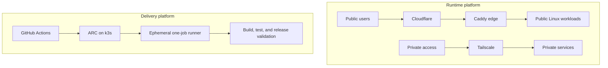

# KanterLabs

**Developer tools, self-hosted platforms, and practical software—built with
the infrastructure to run them.**

KanterLabs is an independent product and infrastructure studio founded and
operated by [Shane Kanterman](https://shanekanterman.dev/). The work spans
Linux systems, networking, continuous delivery, developer tooling, and
user-facing applications, with an emphasis on clear boundaries, repeatable
operations, and honest documentation.

## What we build

- **Developer tools** that make software delivery faster and easier to inspect.
- **Self-hosted platforms** that keep deployment and operational ownership
  understandable.
- **Practical applications** used to exercise the platform under real
  constraints.

## Infrastructure at a glance

KanterLabs runs a small Proxmox-based Linux platform. Public traffic enters
through Cloudflare and a shared Caddy edge before reaching isolated application
workloads. Private services use a separate Tailscale path, and management
access is not treated as application ingress.

GitHub Actions jobs run on a dedicated k3s environment. Actions Runner
Controller creates an ephemeral runner pod on demand, the pod handles one job
with its own Docker daemon, and the job environment is removed afterward.

The platform is built around a few operating principles:

- Public, private, and management paths have distinct trust boundaries.
- Application ingress is centralized instead of exposing workloads directly.
- CI jobs receive disposable environments instead of sharing persistent
  runners.
- Infrastructure configuration is reviewed in Git, while credentials remain
  outside Git and are provided only where they are needed.
- Changes favor explicit validation and recovery paths over hidden automation.

> This is intentionally an architecture-level view. Network addresses,
> internal endpoints, capacity, credentials, and recovery procedures are not
> public documentation.

## Selected projects

| Project | What it is |
| --- | --- |
| [Greenlit](https://github.com/KanterLabs/greenlit-app) | A pre-release Rust CLI for running GitHub Actions workflows locally with an emphasis on fidelity, containment, and inspectable evidence. |
| [Hostlet](https://github.com/KanterLabs/hostlet-core) | An open-source control panel for deploying GitHub-backed web applications on your own server. |
| [Linkshare](https://github.com/KanterLabs/linkshare) | A lightweight Go service and Codex skill for passing one-time links between a person and coding agents. |
| [Portfolio](https://github.com/KanterLabs/portfolio) | The source and infrastructure case studies behind Shane's public portfolio. |

Projects are at different stages of development. Each repository's README is
the source of truth for its current status, supported platforms, and usage.

## How we work

- Build product code and the delivery path together.
- Prefer small systems with explicit ownership and failure boundaries.
- Minimize persistent privilege and state in automation.
- Document limitations as carefully as capabilities.

Learn more about the work and its operator at
[shanekanterman.dev](https://shanekanterman.dev/).
