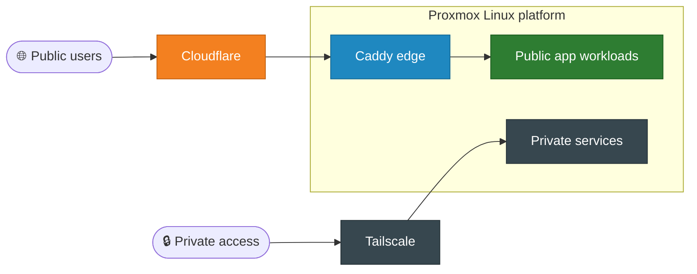
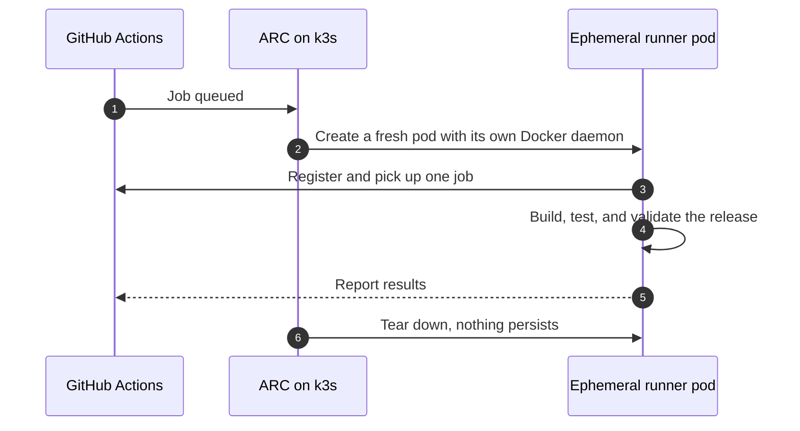

<div align="center">

# KanterLabs

**Developer tools, self-hosted platforms, and practical software, built with
the infrastructure to run them.**

[](https://shanekanterman.dev/)
[](https://hostlet.cloud)

     <br>
       

[**Featured**](#featured-nfl-scores) · [**Projects**](#projects) · [**Infrastructure**](#infrastructure) · [**How we work**](#how-we-work)

</div>

KanterLabs is an independent product and infrastructure studio founded and
operated by [Shane Kanterman](https://shanekanterman.dev/). The work spans
Linux systems, networking, continuous delivery, developer tooling, and
user-facing applications, with an emphasis on clear boundaries, repeatable
operations, and honest documentation.

<table>
<tr>
<td width="33%" valign="top">

### 🛠️ Developer tools
Software that makes delivery faster and easier to inspect.

</td>
<td width="33%" valign="top">

### 🏗️ Self-hosted platforms
Deployment and operations you own and can understand end to end.

</td>
<td width="33%" valign="top">

### 🖥️ Practical apps
Desktop and web software that runs on the platform under real constraints.

</td>
</tr>
</table>

## Featured: NFL Scores

<div align="center">

<a href="https://github.com/KanterLabs/nfl-scores"></a>

**[NFL Scores](https://github.com/KanterLabs/nfl-scores): live NFL scores and a drawn-on-the-field gamecast, built right into GNOME Shell.**<br>
Press <kbd>Super</kbd> + <kbd>F</kbd> from anywhere on your desktop. Press it again and it's gone.

[](https://github.com/KanterLabs/nfl-scores)
[](https://github.com/KanterLabs/nfl-scores#data-and-network-use)
[](https://github.com/KanterLabs/nfl-scores/blob/main/LICENSE)

</div>

<table>
<tr>
<td width="50%" valign="top"><br><b>Every game at a glance.</b> Live games first, with the clock, down and distance, possession, and red-zone tags. Fresh scores flash for 30 seconds.</td>
<td width="50%" valign="top"><br><b>A gamecast drawn on the field.</b> Passes and kicks fly in arcs, runs travel the turf, and banners call out touchdowns, turnovers, and sacks as they happen.</td>
</tr>
<tr>
<td width="50%" valign="top"><br><b>Play by play.</b> Every play grouped by drive, with colored type tags and yards gained or lost.</td>
<td width="50%" valign="top"><br><b>Box score.</b> Points by quarter, scoring plays, team stat comparisons, and the leaders.</td>
</tr>
</table>

Frosted liquid-glass styling, animations drawn with Cairo, and no account, no API key, and no tracking. It only fetches data while the popup is open.

```bash
git clone https://github.com/KanterLabs/nfl-scores.git && cd nfl-scores && make install
```

<p align="center"><a href="https://github.com/KanterLabs/nfl-scores"><b>View NFL Scores on GitHub →</b></a></p>

## Projects

### Desktop

| Project | What it is | Stack |
| --- | --- | --- |
| **[NFL Scores](https://github.com/KanterLabs/nfl-scores)** | Live NFL scores and an animated, drawn-on-the-field gamecast for GNOME Shell. Press <kbd>Super</kbd> + <kbd>F</kbd> and it's there. | GJS · Cairo |
| **[Pulse](https://github.com/KanterLabs/pulse)** | A fast GNOME command center for Spotify on Fedora, with a Rust daemon and optional headless playback. *Pre-alpha.* | GJS · Rust · D-Bus |
| **[ncspot](https://github.com/KanterLabs/ncspot)** | A visually expressive fork of the ncspot terminal Spotify client. | Rust · TUI |

### Self-hosted platforms

| Project | What it is | Stack |
| --- | --- | --- |
| **[Hostlet Core](https://github.com/KanterLabs/hostlet-core)** | Turn GitHub repositories into live apps on your own Linux server: builds, containers, routing, health checks, and rollback. Powers [hostlet.cloud](https://hostlet.cloud). *Pre-1.0 beta.* | Rust · Next.js |
| **[Helm](https://github.com/KanterLabs/helm)** | An open-source project board and roadmap with scoped agent automation, built for you to run on your own server. | Go · Svelte |

### Web

| Project | What it is | Stack |
| --- | --- | --- |
| **[Portfolio](https://github.com/KanterLabs/portfolio)** | The source and infrastructure case studies behind Shane's portfolio, live at [shanekanterman.dev](https://shanekanterman.dev/). | TypeScript |

Projects are at different stages of development. Each repository's README is
the source of truth for its current status, supported platforms, and usage.

## Infrastructure

KanterLabs runs a small Proxmox-based Linux platform. Public traffic enters
through Cloudflare and a shared Caddy edge before reaching isolated application
workloads. Private services use a separate Tailscale path, and management
access is not treated as application ingress.


```mermaid
flowchart LR
    users(["🌐 Public users"]) --> cf["Cloudflare"]
    cf --> edge["Caddy edge"]
    edge --> apps["Public app workloads"]

    team(["🔒 Private access"]) --> ts["Tailscale"]
    ts --> priv["Private services"]

    subgraph host["Proxmox Linux platform"]
        edge
        apps
        priv
    end

    classDef ext fill:#f38020,stroke:#c2600f,color:#fff
    classDef edgeC fill:#1f88c0,stroke:#166a96,color:#fff
    classDef pub fill:#2e7d32,stroke:#1b5e20,color:#fff
    classDef prv fill:#37474f,stroke:#263238,color:#fff
    class cf ext
    class edge edgeC
    class apps pub
    class ts,priv prv
```

GitHub Actions jobs run on a dedicated k3s environment. Actions Runner
Controller creates an ephemeral runner pod on demand, the pod handles exactly
one job with its own Docker daemon, and the job environment is removed
afterward.


```mermaid
sequenceDiagram
    autonumber
    participant GH as GitHub Actions
    participant ARC as ARC on k3s
    participant Pod as Ephemeral runner pod
    GH->>ARC: Job queued
    ARC->>Pod: Create a fresh pod with its own Docker daemon
    Pod->>GH: Register and pick up one job
    Pod->>Pod: Build, test, and validate the release
    Pod-->>GH: Report results
    ARC->>Pod: Tear down, nothing persists
```

The platform is built around a few operating principles:

| Principle | In practice |
| --- | --- |
| **Separate trust boundaries** | Public, private, and management paths never share a route. |
| **One front door** | Application ingress is centralized instead of exposing workloads directly. |
| **Disposable CI** | Every job gets a clean environment instead of a shared, persistent runner. |
| **Config in Git, secrets out** | Infrastructure changes are reviewed in Git; credentials live outside it and go only where needed. |
| **Explicit over magic** | Changes favor visible validation and recovery paths over hidden automation. |

> This is intentionally an architecture-level view. Network addresses,
> internal endpoints, capacity, credentials, and recovery procedures are not
> public documentation.

## How we work

- Build product code and the delivery path together.
- Prefer small systems with explicit ownership and failure boundaries.
- Minimize persistent privilege and state in automation.
- Document limitations as carefully as capabilities.

<div align="center">

**Learn more about the work and its operator at [shanekanterman.dev](https://shanekanterman.dev/).**

</div>
