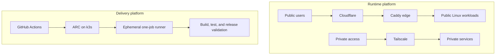

# KanterLabs

**Developer tools, self-hosted platforms, and practical software—built with
the infrastructure to run them.**

KanterLabs is an independent product and infrastructure studio founded and
operated by [Shane Kanterman](https://shanekanterman.dev/). The work spans
Linux systems, networking, continuous delivery, developer tooling, and
user-facing applications, with an emphasis on clear boundaries, repeatable
operations, and honest documentation.

## Featured: NFL Scores

<div align="center">

<a href="https://github.com/KanterLabs/nfl-scores"></a>

**[NFL Scores](https://github.com/KanterLabs/nfl-scores): live NFL scores and a drawn-on-the-field gamecast, built right into GNOME Shell.**<br>
Press <kbd>Super</kbd> + <kbd>F</kbd> from anywhere on your desktop. Press it again and it's gone.

[](https://github.com/KanterLabs/nfl-scores)
[](https://github.com/KanterLabs/nfl-scores#data-and-network-use)
[](https://github.com/KanterLabs/nfl-scores/blob/main/LICENSE)

</div>

<table>
<tr>
<td width="50%" valign="top"><br><b>Every game at a glance.</b> Live games first, with the clock, down and distance, possession, and red-zone tags. Fresh scores flash for 30 seconds.</td>
<td width="50%" valign="top"><br><b>A gamecast drawn on the field.</b> Passes and kicks fly in arcs, runs travel the turf, and banners call out touchdowns, turnovers, and sacks as they happen.</td>
</tr>
<tr>
<td width="50%" valign="top"><br><b>Play by play.</b> Every play grouped by drive, with colored type tags and yards gained or lost.</td>
<td width="50%" valign="top"><br><b>Box score.</b> Points by quarter, scoring plays, team stat comparisons, and the leaders.</td>
</tr>
</table>

Frosted liquid-glass styling, animations drawn with Cairo, and no account, no API key, and no tracking. It only fetches data while the popup is open.

```bash
git clone https://github.com/KanterLabs/nfl-scores.git && cd nfl-scores && make install
```

<p align="center"><a href="https://github.com/KanterLabs/nfl-scores"><b>View NFL Scores on GitHub →</b></a></p>

## What we build

- **Developer tools** that make software delivery faster and easier to inspect.
- **Self-hosted platforms** that keep deployment and operational ownership
  understandable.
- **Practical applications** used to exercise the platform under real
  constraints.

## Infrastructure at a glance

KanterLabs runs a small Proxmox-based Linux platform. Public traffic enters
through Cloudflare and a shared Caddy edge before reaching isolated application
workloads. Private services use a separate Tailscale path, and management
access is not treated as application ingress.

GitHub Actions jobs run on a dedicated k3s environment. Actions Runner
Controller creates an ephemeral runner pod on demand, the pod handles one job
with its own Docker daemon, and the job environment is removed afterward.


```mermaid
flowchart TB
    subgraph runtime["Runtime platform"]
        direction LR
        users["Public users"] --> cloudflare["Cloudflare"]
        cloudflare --> edge["Caddy edge"]
        edge --> public["Public Linux workloads"]
        privateAccess["Private access"] --> tailscale["Tailscale"]
        tailscale --> privateServices["Private services"]
    end

    subgraph delivery["Delivery platform"]
        direction LR
        actions["GitHub Actions"] --> arc["ARC on k3s"]
        arc --> runner["Ephemeral one-job runner"]
        runner --> validation["Build, test, and release validation"]
    end
```

The platform is built around a few operating principles:

- Public, private, and management paths have distinct trust boundaries.
- Application ingress is centralized instead of exposing workloads directly.
- CI jobs receive disposable environments instead of sharing persistent
  runners.
- Infrastructure configuration is reviewed in Git, while credentials remain
  outside Git and are provided only where they are needed.
- Changes favor explicit validation and recovery paths over hidden automation.

> This is intentionally an architecture-level view. Network addresses,
> internal endpoints, capacity, credentials, and recovery procedures are not
> public documentation.

## Selected projects

| Project | What it is |
| --- | --- |
| [Helm](https://github.com/KanterLabs/helm) | An open-source project board and roadmap with scoped agent automation, built for you to run on your own server. |
| [NFL Scores](https://github.com/KanterLabs/nfl-scores) | Live NFL scores and an animated, drawn-on-the-field gamecast for GNOME Shell. Press <kbd>Super</kbd> + <kbd>F</kbd> and it's there. |
| [Portfolio](https://github.com/KanterLabs/portfolio) | The source and infrastructure case studies behind Shane's portfolio, live at [shanekanterman.dev](https://shanekanterman.dev/). |

Projects are at different stages of development. Each repository's README is
the source of truth for its current status, supported platforms, and usage.

## How we work

- Build product code and the delivery path together.
- Prefer small systems with explicit ownership and failure boundaries.
- Minimize persistent privilege and state in automation.
- Document limitations as carefully as capabilities.

Learn more about the work and its operator at
[shanekanterman.dev](https://shanekanterman.dev/).
